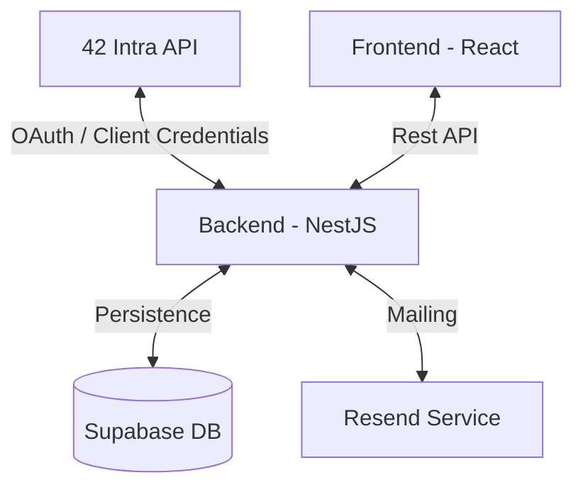

# 🚀 Find Internship

[](https://nestjs.com/)
[](https://reactjs.org/)
[](https://supabase.com/)
[](https://resend.com/)

A **Find Internship** é uma plataforma premium de agregação e notificação de vagas de estágio, concebida exclusivamente para a comunidade da **Escola 42**. Ela simplifica a procura de oportunidades na 42 Intra através de filtros avançados e alertas inteligentes via e-mail.

---

## 🌟 Principais Funcionalidades

- **Autenticação Oficial 42:** Login seguro utilizando o protocolo OAuth 2.0 da 42 Intra.
- **Busca Avançada & Inteligente:** Filtros por cidade, país, tipo de contrato (CDI, CDD, Estágio) e regime 100% remoto.
- **Sistema de Alertas Múltiplos:** Criação de diversos perfis de busca. Receba notificações apenas do que realmente lhe interessa.
- **Notificações Automáticas:** Bot de background que monitoriza novas vagas e envia e-mails em tempo real via **Resend**.
- **Interface Premium:** Design moderno com modo escuro, micro-animações fluidas e experiência de utilizador otimizada.
- **Sincronização 24/7:** Cron jobs automáticos que garantem que os dados estão sempre atualizados com a Intra.

---

## 🛠️ Stack Tecnológica

### **Backend**
- **Core:** NestJS (Node.js) com TypeScript.
- **Autenticação:** Passport JWT e 42 OAuth Strategy.
- **Dados:** Supabase (PostgreSQL).
- **Comunicação:** Resend API para envio de e-mails transacionais.
- **Agendamento:** NestJS Schedule (Cron Jobs).

### **Frontend**
- **Core:** React 18 com Vite.
- **Estilização:** Tailwind CSS v4 & Lucide Icons.
- **Animações:** Framer Motion.
- **Deploy:** Vercel.

---

## 🏗️ Arquitetura do Sistema



---

## 🚦 Início Rápido

### Pré-requisitos
- Node.js (v18+)
- Credenciais da API da 42 (UID e Secret)
- Conta no Supabase e Chave da API do Resend

### Configuração do Ambiente

1. **Clone o repositório:**
   ```bash
   git clone https://github.com/seu-usuario/find-intership.git
   ```

2. **Backend:**
   ```bash
   cd backend
   npm install
   # Configure o ficheiro .env com as chaves necessárias
   npm run start:dev
   ```

3. **Frontend:**
   ```bash
   cd frontend
   npm install
   # Configure o VITE_API_URL no .env
   npm run dev
   ```

---

## 📄 Documentação Adicional

Para informações mais detalhadas, consulte os nossos manuais:
- [📖 Guia do Utilizador (USER_DOC.md)](./docs/USER_DOC.md) - Como utilizar a plataforma.
- [💻 Guia do Desenvolvedor (DEV_DOC.md)](./docs/DEV_DOC.md) - Arquitetura, setup técnico e contribuição.

---

## ⚖️ Licença

Este projeto está sob a licença MIT. Veja o ficheiro [LICENSE](LICENSE) para detalhes.

---
<p align="center">
  Desenvolvido por <strong>Amarildo dos Santos</strong>
</p>
