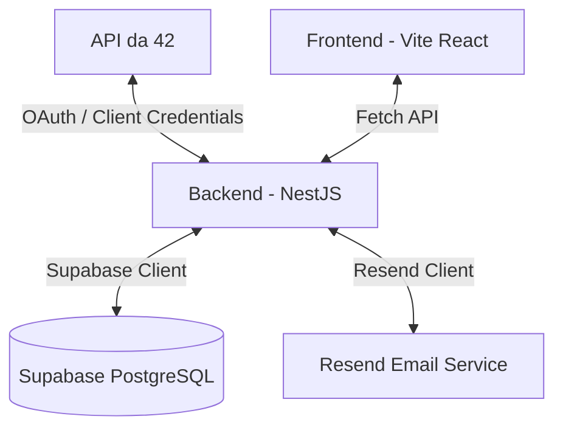

# Relatório de Auditoria e Análise de Código: Find Internship

Este documento apresenta uma análise técnica detalhada do projeto **Find Internship** (Frontend e Backend), descrevendo o seu funcionamento, arquitetura, pontos fortes, bugs identificados e oportunidades de melhoria.

---

## 1. Visão Geral do Projeto
O **Find Internship** é uma plataforma que integra a API oficial da Escola 42 (`api.intra.42.fr`) para recolher, filtrar e notificar os utilizadores sobre oportunidades de estágio e emprego.

### Arquitetura de Componentes


- **Frontend (Vite + React + Tailwind v4 + Framer Motion):** Interface moderna que permite pesquisar e filtrar vagas por cidade, país, tipo de contrato, skills e regime remoto, além de ativar/desativar notificações por e-mail.
- **Backend (NestJS):** Expõe APIs para listagem e autenticação OAuth, gere uma cache em memória e sincroniza dados em base de dados de hora a hora via Cron Jobs.
- **Base de Dados (Supabase/PostgreSQL):** Armazena utilizadores (`app_users`), vagas sincronizadas (`internship_offers`) e logs de envio de notificações para evitar duplicados (`notified_offers`).
- **Serviço de E-mail (Resend):** Responsável pelo disparo de notificações automáticas em HTML para os estudantes.

---

## 2. Pontos Fortes do Projeto
- **Design de Interface Premium:** Utilização de gradientes modernos, blur de fundo, micro-animações suaves com `framer-motion` e visualização otimizada para temas escuros.
- **Single Flight Pattern para Cache:** O `AppService` gere a atualização da cache de vagas evitando condições de corrida concorrentes com a variável `fetchPromise`.
- **Filtro Inteligente de Skills:** Busca flexível baseada em mapeamento de palavras-chave relacionadas (ex: mapear `node` para termos como `express`, `nest`, `typescript`).
- **Estabilidade IPv4:** Forçar a família de rede `4` para o Axios ao comunicar com a 42 Intra evita falhas de rede comuns em ambientes cloud.

---

## 3. Bugs Identificados e Falhas Lógicas

### 🚨 Bug Crítico 1: Referência a ID incorreto no Bot de Notificações (`user.userId` vs `user.external_id`)
* **Ficheiro:** [notifications.service.ts](file:///home/amdos-sa/find_intership/backend/src/notifications/notifications.service.ts#L147-L182)
* **Descrição:** O bot de notificações lê utilizadores da tabela `app_users`. Nessa tabela, a coluna chave para o ID da 42 chama-se `external_id` (visto no `auth.service.ts`). Contudo, o código de notificações tenta aceder a `user.userId` (que retorna `undefined`).
* **Consequências:**
  1. A query à tabela `notified_offers` passa a pesquisar por `user_id = undefined`.
  2. Ao tentar inserir a notificação como enviada, executa `Number(user.userId)` que resulta em `NaN`. Isto faz o insert falhar na base de dados, fazendo com que o bot ou lance erros ou reenvie repetidamente o mesmo e-mail todas as horas.
* **Linhas Afetadas:**
  ```typescript
  // notifications.service.ts L147
  .eq('user_id', user.userId); // Incorreto, deve ser user.external_id

  // notifications.service.ts L181
  user_id: Number(user.userId) // Incorreto, deve ser Number(user.external_id)
  ```

---

### 🚨 Bug Crítico 2: Instanciação Duplicada do `AppService` (Concorrência e Rate Limit)
* **Ficheiro:** [notifications.module.ts](file:///home/amdos-sa/find_intership/backend/src/notifications/notifications.module.ts#L9)
* **Descrição:** O `AppService` está declarado no array `providers` tanto do `AppModule` como do `NotificationsModule`. Como o `NotificationsModule` não o exporta e o declara novamente, o NestJS cria **duas instâncias distintas** deste serviço na inicialização da aplicação.
* **Consequências:**
  - Duas chamadas independentes ao `refreshToken()` no arranque do servidor.
  - Duplicação de execuções do Cron `@Cron('0 * * * *')` associado ao `AppService`.
  - Desperdício de memória RAM e chamadas duplicadas à API 42 que podem causar rate limiting (Erros 429).
* **Solução:** Remover `AppService` da lista de providers no `NotificationsModule`. O `NotificationsService` não o injeta nem depende dele.

---

### 🚨 Bug Crítico 3: Lógica Inconsistente de Vagas Novas com `last_login`
* **Ficheiro:** [notifications.service.ts](file:///home/amdos-sa/find_intership/backend/src/notifications/notifications.service.ts#L155)
* **Descrição:** A query para buscar vagas a notificar utiliza `.gt('created_at', lastLogin)`. 
* **Cenário de Falha:**
  1. O Cron correu às 15:00.
  2. Uma nova vaga é criada às 15:15.
  3. O utilizador faz login no frontend às 15:30. Isto atualiza imediatamente o seu `last_login` para 15:30 na base de dados.
  4. O Cron corre novamente às 16:00. Ele procura vagas com `created_at > last_login` (15:30).
  5. A vaga das 15:15 é ignorada e o utilizador **nunca** é notificado sobre ela.
* **Solução:** Em vez de filtrar por `last_login`, buscar vagas criadas nos últimos 7 dias e deixar o filtro de exclusão puramente a cargo da tabela `notified_offers`.

---

### ⚠️ Vulnerabilidade de Segurança 4: Falta de Validação de Tokens JWT nas Rotas
* **Ficheiro:** [auth.controller.ts](file:///home/amdos-sa/find_intership/backend/src/auth/auth.controller.ts#L36) e [app.controller.ts](file:///home/amdos-sa/find_intership/backend/src/app.controller.ts#L17)
* **Descrição:** Nenhuma das rotas do backend está protegida com guards de autenticação JWT (ex: `AuthGuard`). Embora o frontend envie o token via header `Authorization: Bearer <token>`, o backend ignora-o.
* **Risco de Segurança:** Qualquer pessoa pode efetuar um pedido POST para `/auth/notifications` com o `userId` de outra pessoa e alterar as suas opções de notificação ou forçar o disparo de e-mails de status do sistema.

---

### ⚠️ Inconsistência 5: Filtros dos Utilizadores não Persistidos
* **Ficheiro:** [App.tsx](file:///home/amdos-sa/find_intership/frontend/src/App.tsx)
* **Descrição:** O bot de notificações tenta ler os filtros em `user.filters` para aplicar filtros específicos aos e-mails. Contudo, não existe no frontend nenhuma opção ou chamada de rede para salvar os filtros na base de dados. Eles residem puramente no estado local React do browser.
* **Solução:** Criar um endpoint `POST /auth/filters` e uma interface no frontend para permitir ao utilizador escolher se quer receber todas as vagas ou apenas as correspondentes aos filtros selecionados.

---

## 6. Recomendações de Melhorias Práticas

1. **Ajuste de Visualização do Utilizador em Dispositivos Móveis:**
   - O cabeçalho com o avatar e login do utilizador autenticado (`authenticated as @login`) está oculto em resoluções móveis (`hidden md:flex`). Recomenda-se mover este elemento para um pequeno botão no topo que mostre um menu dropdown.
2. **Tratamento de Erros de Base de Dados no Toggle:**
   - Atualmente, se a operação no Supabase falhar na função `toggleNotifications`, o backend apenas regista um log de erro, mas devolve status `200/201` com `null`. O frontend assume sucesso e guarda o estado incorreto no `localStorage`. Deve ser lançado um erro HTTP (`HttpException`) em caso de falha de gravação na DB.
3. **Substituição de Valores Default Inconsistentes:**
   - Harmonizar o fallback do estado de notificações no frontend para evitar que exiba momentaneamente o valor incorrecto enquanto o token é lido.
